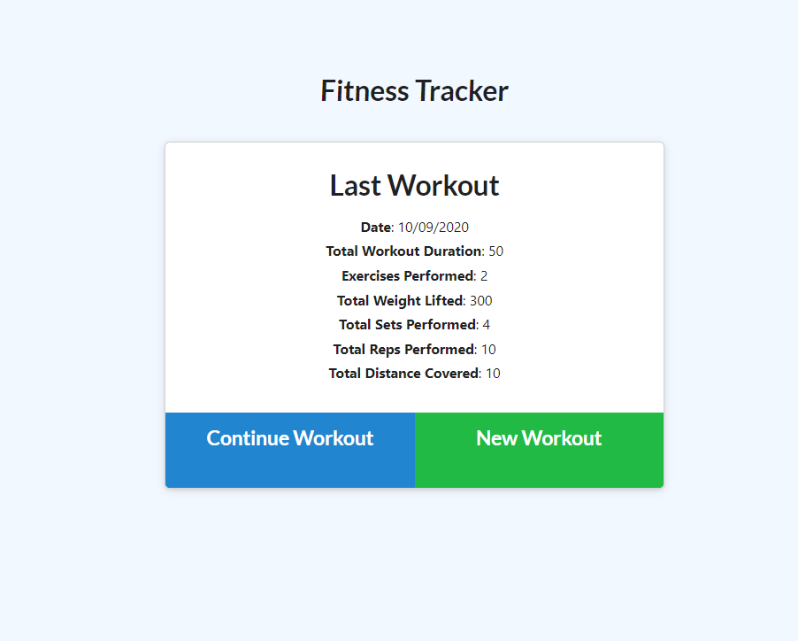
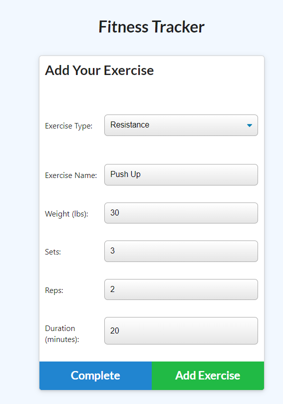
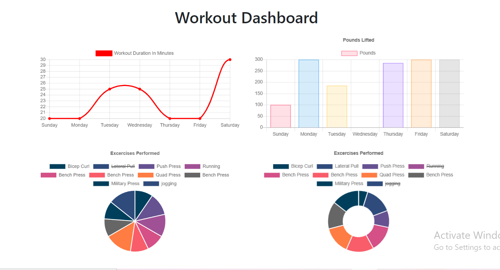

# NoSQL: Workout Tracker


## Workout Tracker

## Live URL
https://warm-hollows-28275.herokuapp.com/

## Description
To create a workout tracker. This app requires to create Mongo database with a Mongoose schema and handle routes with Express.
## Table of Contents
* [License](#license)
* [Installation](#installation)
* [Tests](#tests)
* [Usage](#usage)
* [Credits](#contribution)
* [Questions](#questions)

## Installation
``` Install Node.js first, and then run npm install , Install Heroku```
## Tests
``` Terminal Tab 1: mongod  ```
``` Terminal Tab 2: npm install, npm run seed, npm start ```
## Usage
As a user, I want to be able to view create and track daily workouts. I want to be able to log multiple exercises in a workout on a given day. I should also be able to track the name, type, weight, sets, reps, and duration of exercise. If the exercise is a cardio exercise, I should be able to track my distance traveled.
## License
MIT
## Credits
* Node JS
* Express Framework
* NoSQL MongoDB
* mongoose, path, morgan, mongojs package
## Questions
GitHub: https://github.com/miao0007

Email: miao188@hotmail.com

## Deployed Site Preview

### Web Page




